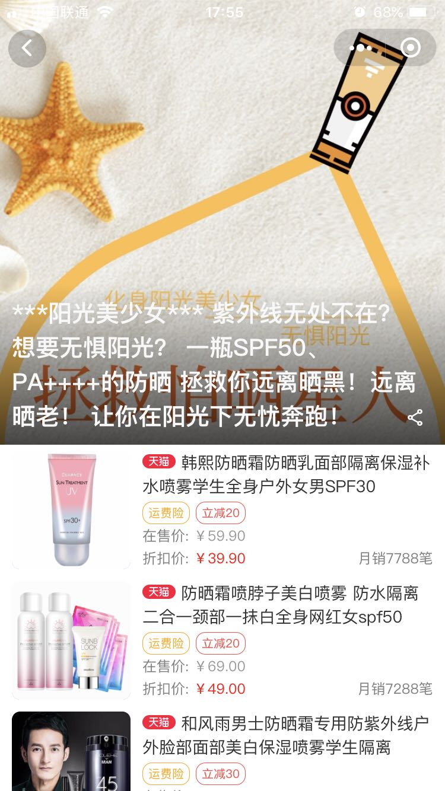

# htq-wxapp


淘宝商品导购及优惠券查询小程序

使用mpvue开发，目前仅支持微信小程序

项目预览




## Build Setup

``` bash
# 安装依赖
yarn

# 开发时构建
npm dev

# 打包构建
npm build

# 指定平台的开发时构建(微信、百度、头条、支付宝)
npm dev:wx
npm dev:swan
npm dev:tt
npm dev:my

# 指定平台的打包构建
npm build:wx
npm build:swan
npm build:tt
npm build:my

# 生成 bundle 分析报告
npm run build --report
```
